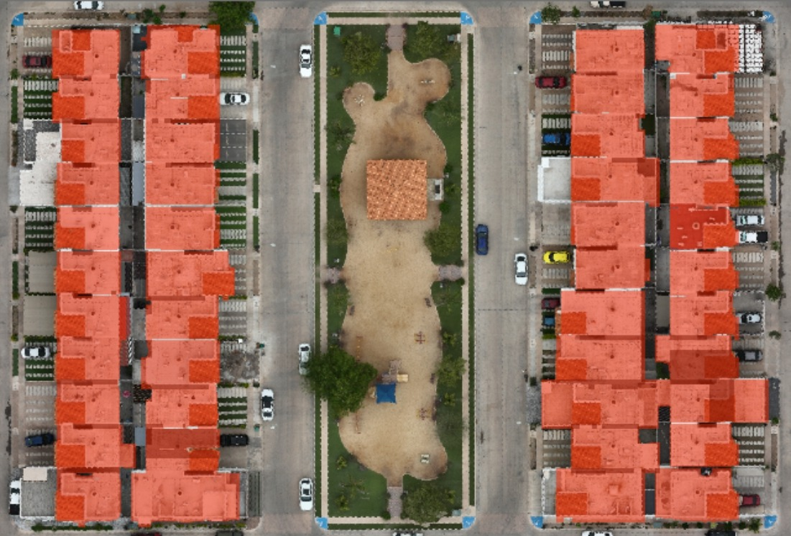
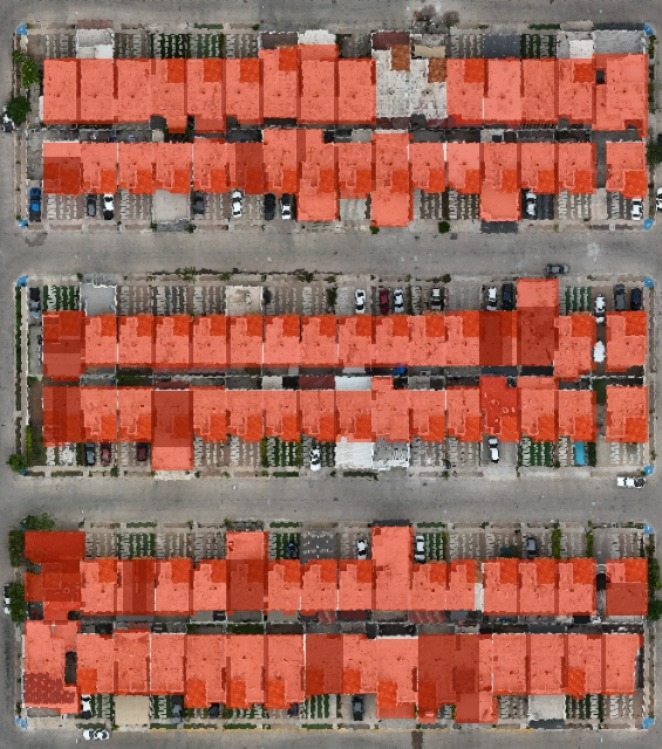
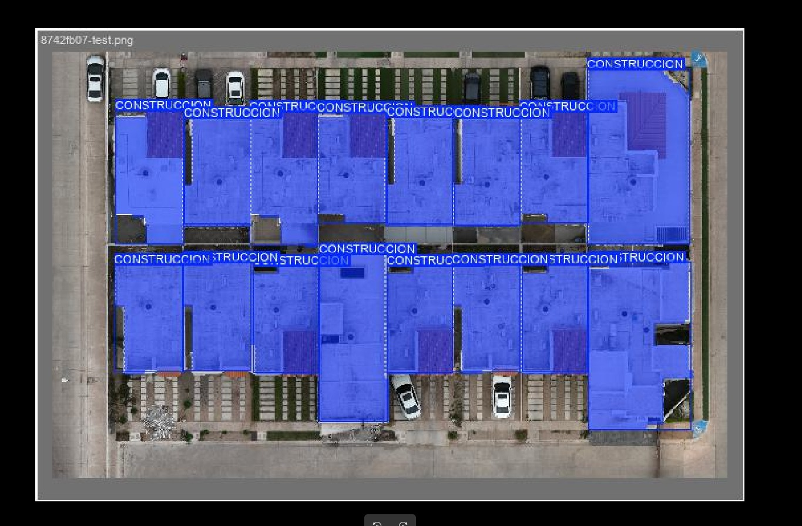
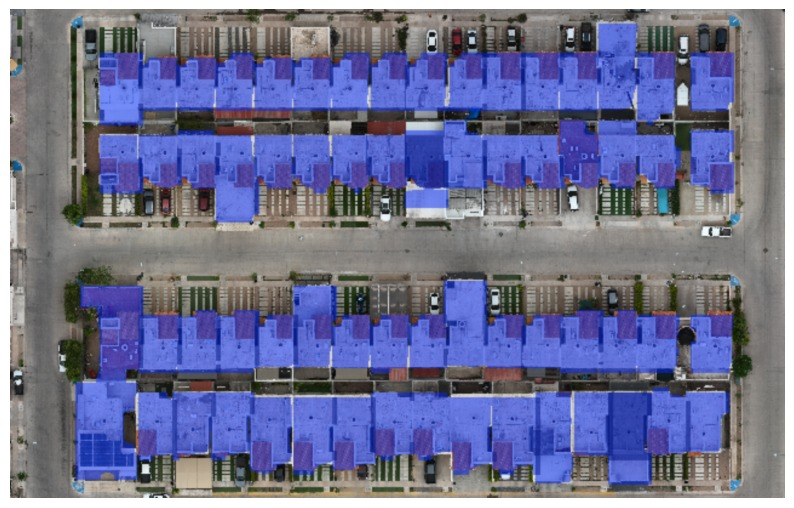

# Construction Area Detector Using YOLO and Satellite Images

## Project Overview

This project involves the development of an AI-based detector to calculate the square meters of construction from satellite images. It uses the YOLO (You Only Look Once) model to detect building areas and segment the rooftops of constructions from satellite imagery. This information can be used for automated property assessments, urban planning, and construction monitoring.

## Dataset and Images

### Image 1: Segmentation Example


### Image 2: Construction Area Segmentation


### Image 3: Rooftop Segmentation


### Image 4: Before and After Segmentation


The dataset consists of satellite images of residential areas. The project uses labeled data where the rooftops of buildings have been segmented for training purposes. The dataset contains both the original images and annotated ones, which are stored in the `docs` folder. Example images are provided:

- `1.jpeg`: Sample segmented image (blue areas indicate construction).
- `2.jpeg`: Another example of segmented constructions.
- `3.jpeg`: Example image showing the segmentation of the building rooftops.
- `4.jpeg`: Before and after comparison of the original image and the AI-generated segmentation.
- `5.jpeg`: Another comparison for model validation.

These images can be found in the `docs` folder and are essential for visualizing the results of the model's performance.

## Technologies Used

- **YOLOv8**: For object detection and segmentation of rooftops.
- **Python**: For scripting and training the YOLO model.
- **OpenCV**: For image processing.
- **Gradio**: For creating an interactive web interface to upload images and see segmentation results.
- **Matplotlib**: For visualizing the results.

## Installation

1. Clone the repository:

```bash
git clone https://github.com/your-repo/construction-area-detector.git
cd construction-area-detector
```

2. Install the required dependencies:

```bash
pip install -r requirements.txt
```

3. Download YOLOv8 from the official `ultralytics` repository and set up the environment.

4. Place the training images in the appropriate folder (`data/images`), ensuring they are labeled correctly.

## Training the Model

1. Prepare the dataset, ensuring each image is annotated for the specific regions of interest (in this case, the rooftops of constructions).
2. Train the YOLO model using the following command:

```bash
python train.py --data data.yaml --weights yolov8.pt --epochs 100 --batch-size 16
```

The `data.yaml` file should specify the path to the images and their annotations.

3. After training, the model weights will be saved in the `runs` folder.

## Running the Model

Once the model is trained, you can use it to predict the construction areas on new satellite images.

```bash
python predict.py --weights best.pt --source data/test_images --save-txt --save-conf
```

This command will process the test images and output the detected areas with bounding boxes or segmentation masks in the `results` folder.

## Web Interface

A simple web interface is provided to allow users to upload satellite images and receive the estimated square meters of construction.

1. Run the Gradio app:

```bash
python app.py
```

2. Open the local URL provided by Gradio, and upload a satellite image to get the segmentation result.

## Results

The output includes images with segmented rooftops, where each detected region represents a building area. The results can be visualized as images in the `results` folder, and the calculated square meters of the segmented areas are printed as output.

---

This project demonstrates the use of satellite images and YOLO for detecting construction areas and estimating their square meters. The system is scalable and can be fine-tuned for other types of buildings or urban settings.

For more details, see the `docs` folder for visual examples and annotated datasets.
